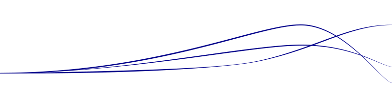

---
output:
  html_document:
    keep_md: yes
    theme: journal
    includes:
      in_header: header.html
    pandoc_args: [
      "--title-prefix", "Erik-Jan van Kesteren - Blog"
    ]
---

 
</img>

# Erik-Jan van Kesteren

#### Blogging about statistics with R (and other things I find interesting)

</img>

# Blog posts

[## [vovk-sellke maximum *p*-ratio](posts/vs-mpr.html)]: #

[#### A more precise way to report the information contained in the *p*-value]: #

[## [blim](posts/blim.html)]: #

[### Bayesian linear models made easy and fast]: #

[## [densy](posts/densy.html)]: #

[#### An app to visualise different probability distributions]: #

[## [whitening](posts/whitening.html)]: #

[#### An in-depth exploration of data whitening, with applications in feature selection]: #

## [crossy road](posts/crossyroad.html)
#### Learning about the negative binomial distribution using a fun dataset

 

<h1>
 About 
</h1>

I am a graduate student at Utrecht University, finishing my MSc in Methodology and Statistics. You can get more information about me at my [linkedin](https://www.linkedin.com/in/erikjanvankesteren) and my [github](https://github.com/vankesteren/) accounts. If you want to get in contact, you can use my 
 

Here are some links to statistics-related things I enjoy: 
[JASP](https://jasp-stats.org),
[Young Statisticians Netherlands](http://youngstatisticians.nl),
[Explained Visually](http://setosa.io/ev/),
[The Etz-Files](https://alexanderetz.com/),
[Richard Morey](https://richarddmorey.org/),
[r/dataisbeautiful](https://www.reddit.com/r/dataisbeautiful/),
[Jeff Rouder](http://jeffrouder.blogspot.com),
[A Compendium of Clean Graphs](http://shinyapps.org/apps/RGraphCompendium/index.php).

