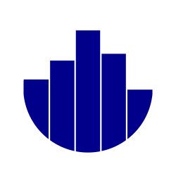
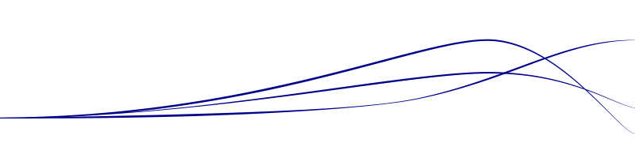

 
</img>

# Erik-Jan van Kesteren

#### Blogging about statistics with R (and other things I find interesting)

</img>

# Blog posts

[## [analysis of no variance](posts/anovanovar.html)]: #

[#### Simulation of a common problem in biological experiments]: #

[## [vovk-sellke maximum *p*-ratio](posts/vs-mpr.html)]: #

[#### A more precise way to report the information contained in the *p*-value]: #

[## [blim](posts/blim.html)]: #

[### Bayesian linear models made easy and fast]: #

[## [random number generators](posts/rng.html)]: #

[### How a deterministic machine generates random values]: #

## [Massign](posts/Massign.html)

#### Simple matrix construction in R

## [sequential statistics](posts/sequentialstats.html)

#### How to calculate the mean of a value stream

## [baron bootstrap](posts/bootstrap.html)

#### Generating intuiton around sampling from samples

## [densy](posts/densy.html)

#### An app to visualise different probability distributions

## [whitening](posts/whitening.html)
#### An in-depth exploration of data whitening, with applications in feature selection

## [crossy road](posts/crossyroad.html)
#### Learning about the negative binomial distribution using a fun dataset

 

<h1 id="About">
 About 
</h1>

I am a PhD student under [Daniel Oberski](http://daob.nl) at the Methodology and Statistics department of Utrecht University. My research is on how we can incorporate high-dimensional data into structural equation models. I'm also a part-time programmer at [JASP](https://jasp-stats.org). You can get more information about me at my [linkedin](https://www.linkedin.com/in/erikjanvankesteren) and my [github](https://github.com/vankesteren/) accounts. If you want to get in contact, you can use my 
 

Here are some links to statistics-related things I enjoy: 
[Young Statisticians Netherlands](http://youngstatisticians.nl),
[Explained Visually](http://setosa.io/ev/),
[distill journal](http://distill.pub),
[Brilliantly Wrong](https://arogozhnikov.github.io/),
[The Etz-Files](https://alexanderetz.com/),
[Richard Morey](https://richarddmorey.org/),
[r/dataisbeautiful](https://www.reddit.com/r/dataisbeautiful/),
[Jeff Rouder](http://jeffrouder.blogspot.com),
[A Compendium of Clean Graphs](http://shinyapps.org/apps/RGraphCompendium/index.php).

code for this website can be found on [github](https://github.com/vankesteren/blog/)

