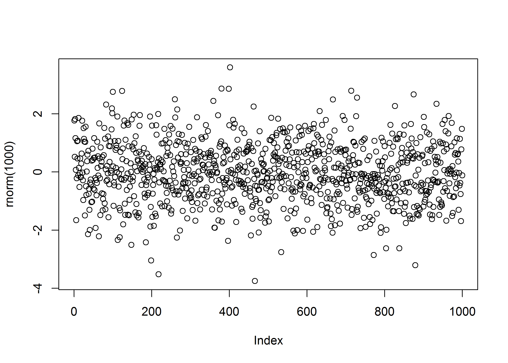

# Bootstrap
Erik-Jan van Kesteren  


###[Back to index](../index.html)


## Introduction
Here is the intro and where I got the inspiration. It leads to this svg in the img folder of the root directory:

</img>

## The post
Here is a png dev image, for if there are a lot of points in the image (svg becomes slow in this case).


```r
plot(rnorm(1000))
```

<!-- -->

With few points, it's better to use the standard svg.

```r
barplot(c(2, 4, 6, 5, 1), col = "#00008B", border = "#00008B")
```

<!-- -->

###[Back to index](../index.html)
