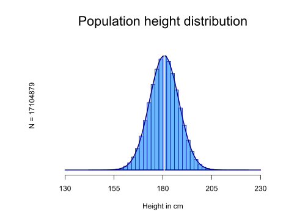
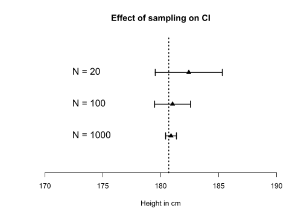
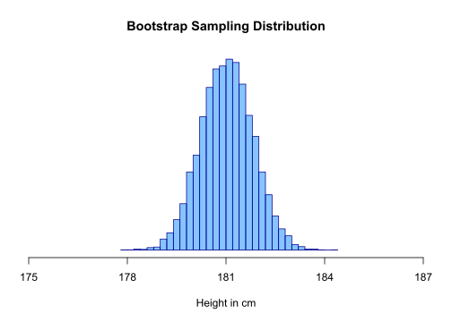
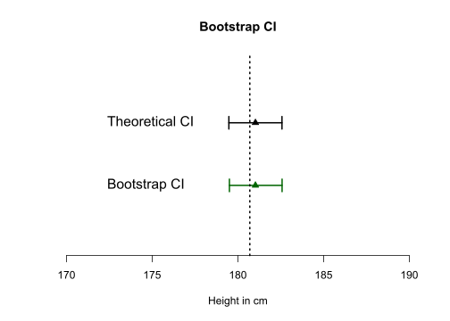
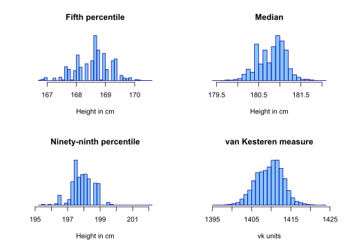
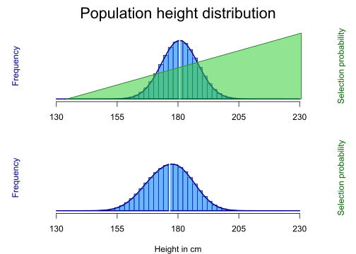
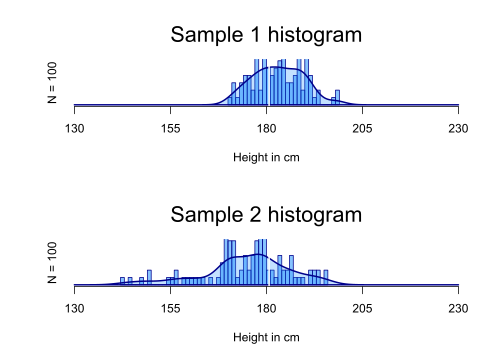

# Bootstrap
Erik-Jan van Kesteren  


###[Back to index](../index.html)


## Introduction
The word "bootstrap" comes from an old story about a hero - Baron Munchausen - who is riding around on his horse in a forest and suddenly gets stuck in a swamp. He screams for help but there is no one around who hears his voice! Luckily our hero does not give up and gets a great idea: "what if I just pull myself out of this swamp?". He grabs the *straps* of his *boots* and pulls himself loose. Fantastic - he just invented bootstrapping.

</img>
<center> *Baron Munchausen ponytailing out of another swamp.*[^pony] </center>

[^pony]: Source: http://en.citizendium.org/wiki/Image:Dore-Munchausen-pull.jpg

<br/>


Physics-defying stories aside, bootstrapping has become a common term for something seemingly impossible or counterintuitive. In this blogpost I will try to generate an intuition for the properties of *statistical bootstrapping* - resampling from your data to approximate resampling from a population.

## The population
In order to explain bootstrapping, we need to generate an example. Let's assume we want to know the average height of all the people in the Netherlands. With the power of `R` we can easily generate a population of 17104879 people (according to CBS, the amount of registered inhabitants of the Netherlands as per the creation of this post[^cbs]). The Dutch are just about the tallest people on the planet, where the men are 180,7 centimeters tall, on average[^statline]. 

Here is some more information about my population. For the sake of simplicity let's assume that all inhabitants are actually men (which would be a disaster). The tallest Dutch man is 223 centimeters[^lngst] (which is very tall) and the shortest Dutch man is ridiculously hard to find on the internet. I have an intuition that it is further away from the mean of 180.7, which implies some negative skewness, but that's not what this post is about so let's also assume we have a non-skewed normal distribution.

After some fiddling with the standard deviation variable, I simulated the following population:

[^cbs]: Source: https://www.cbs.nl/nl-nl/visualisaties/bevolkingsteller as per the writing of this post.

[^statline]: Source: https://is.gd/cbsdata

[^lngst]: Quick google searchy source: https://www.langzijn.nl/tag/langste-man-nederland


```r
# generate population data
set.seed(3665364)
pop <- rnorm(17104879, mean = 180.7, sd = 7.5)

# plot the distribution
hist(pop, freq = FALSE, ylim = c(0, 0.06), xlim = c(120, 240), axes = FALSE, 
    breaks = 30, xlab = "", ylab = "", main = "", col = "#1E90FF88", border = "#00008B")
polygon(density(pop, from = 130, to = 230), cex = 2, col = "#1E90FF44", border = "#00008B", 
    lwd = 2)
abline(v = 180.7, col = "white", lwd = 2)
axis(1, at = c(130, 155, 180, 205, 230))
mtext("Population height distribution", side = 3, line = 1, cex = 1.8)
mtext("N = 17104879", side = 2, line = 0)
mtext("Height in cm", side = 1, line = 3)
```



Let's look how tall the tallest man from the hypothetical all-men Netherlands is, along with some other statistics!


```r
cat(" Statistics about the population:\n", "--------------------------------\n", 
    "The shortest person is ", min(pop), " cm tall.\n", "Mean height is ", mean(pop), 
    " cm.\n", "Median height is ", median(pop), " cm.\n", "The 5th and 95th percentiles are ", 
    quantile(pop, probs = c(0.05, 0.95)), "cm.\n", "The tallest person is ", 
    max(pop), " cm tall.")
```

```
##  Statistics about the population:
##  --------------------------------
##  The shortest person is  142.0121  cm tall.
##  Mean height is  180.6979  cm.
##  Median height is  180.698  cm.
##  The 5th and 95th percentiles are  168.3612 193.0287 cm.
##  The tallest person is  222.2139  cm tall.
```

That seems close enough to something I'd consider a population.

## The set-up
Normally, when we want to estimate some population parameter such as the mean height, we cannot measure all persons. Therefore, we create a *representative sample* of persons from this population that we *can* measure. The size of our sample ($N$) should depend on how precise we want our final estimate to be - the *standard error* of a statistic depends directly on the number of persons in our sample. For the mean, the standard error is usually calculated as follows:

\[ se_\bar{x} = \frac{\hat{\sigma}}{\sqrt{N}}\text{, where } \hat{\sigma} = \sqrt{\frac{1}{N-1}\sum_{i=1}^N(x_i-\bar{x})^2} \]

With increasing $N$, the $\hat{\sigma}$ becomes smaller, and the $se_\bar{x}$ becomes smaller as well. In words: with a larger sample comes an increase in precision (a reduction in error).

We can display the precision in the form of *confidence intervals* (CI). A $p\%$ CI about an estimate indicates the area in which upon infinitely repeated sampling the TRUE parameter lies $p\%$ of the time. In other words, if we would redo our experiment infinite amount of times, a 95% confidence interval will *cover* the true parameter in 95% of the replications.[^CI]

[^CI]: this explanation follows a frequentist framework of statistics. For an interesting sidestep and Bayesian credible intervals, do read this paper -  http://doi.org/10.3758/s13423-015-0947-8

In real life, there is of course no such thing as infinite resampling; we only sample once and use the CI as an indication of precision. Let's look at how the precision of the mean estimate increases as we take larger samples from the above population.


```r
# randomly sample from population
small <- sample(pop, 20)
medium <- sample(pop, 100)
large <- sample(pop, 1000)

# calculate means
means <- mean(small)
meanm <- mean(medium)
meanl <- mean(large)

# calculate standard errors
ses <- sd(small)/sqrt(length(small))
sem <- sd(medium)/sqrt(length(medium))
sel <- sd(large)/sqrt(length(large))

# calculate confidence intervals
CIs <- c(means - 1.96 * ses, means + 1.96 * ses)
CIm <- c(meanm - 1.96 * sem, meanm + 1.96 * sem)
CIl <- c(meanl - 1.96 * sel, meanl + 1.96 * sel)

# initialise plot
plot(0, xlim = c(170, 190), ylim = c(0, 4), bty = "L", xlab = "Height in cm", 
    ylab = "", axes = F, cex = 1.3, main = "Effect of sampling on CI")
axis(1, cex = 1.3)

# horizontal lines
lines(CIl, y = c(1, 1), lwd = 2)
lines(CIm, y = c(2, 2), lwd = 2)
lines(CIs, y = c(3, 3), lwd = 2)

# points
points(c(means, meanm, meanl), c(3, 2, 1), bg = "black", pch = 24)

# vertical lines
lines(c(CIl[1], CIl[1]), c(0.9, 1.1), lwd = 2)
lines(c(CIl[2], CIl[2]), c(0.9, 1.1), lwd = 2)
lines(c(CIm[1], CIm[1]), c(1.9, 2.1), lwd = 2)
lines(c(CIm[2], CIm[2]), c(1.9, 2.1), lwd = 2)
lines(c(CIs[1], CIs[1]), c(2.9, 3.1), lwd = 2)
lines(c(CIs[2], CIs[2]), c(2.9, 3.1), lwd = 2)

# true mean
abline(v = mean(pop), lwd = 2, lty = 3)

# text
text(y = c(1, 2, 3), x = 172, labels = c("N = 1000", "N = 100", "N = 20"), pos = 4, 
    cex = 1.3)
```



As you can see, the CI from each sample covers the true population value in this case. We can create these confidence intervals because we know the *sampling distribution* of the mean - the distribution of the mean that arises upon repeated sampling. For means of a normally distributed population, the sampling distribution is the familiar Student's *t*-distribution. We use the probability density to determine our 95% CI (the `1.96` in the code above).

But what if we don't exactly know what the sampling distribution is? For example, what happens if we do not have a normally distributed population? It turns out there is another way of generating CIs.

## The bootstrap

The bootstrap has these steps: 

  1. approximate the sampling distribution by taking the mean of n repeated samples with replacement from your original sample.

Huh? Only one step? Is it that simple?

Yes:


```r
# Let's bootstrap 10000 times!
mean_sampling_distribution <- numeric(10000)
for (i in 1:10000) {
    bootstrap_sample <- sample(medium, replace = T)
    mean_sampling_distribution[i] <- mean(bootstrap_sample)
}

opt <- par(mar = c(5, 1, 4, 1))
hist(mean_sampling_distribution, freq = FALSE, xlim = c(175, 187), axes = FALSE, 
    breaks = 30, xlab = "Height in cm", ylab = "", main = "Bootstrap Sampling Distribution", 
    col = "#1E90FF88", border = "#00008B")
axis(1, at = c(175, 178, 181, 184, 187))
```




Great! Now we have an *empirical* sampling distribution. What do we do now in order to get an estimate of our precision in the form of a confidence interval? That is simple too: sort the means attained from the bootstrap samples from low to high, and look at the 2.5th and 97.5th percentile. This yields a 95% bootstrap CI!


```r
CIbootstrap <- quantile(mean_sampling_distribution, probs = c(0.025, 0.975))

# plot
plot(0, xlim = c(170, 190), ylim = c(0, 3), bty = "L", xlab = "Height in cm", 
    ylab = "", axes = F, cex = 1.3, main = "Bootstrap CI")
axis(1, cex = 1.3)

# original CI
lines(CIm, y = c(2, 2), lwd = 2)
lines(c(CIm[1], CIm[1]), c(1.9, 2.1), lwd = 2)
lines(c(CIm[2], CIm[2]), c(1.9, 2.1), lwd = 2)

# bootstrap CI
lines(CIbootstrap, y = c(1, 1), lwd = 2, col = "dark green")
lines(c(CIbootstrap[1], CIbootstrap[1]), c(0.9, 1.1), lwd = 2, col = "dark green")
lines(c(CIbootstrap[2], CIbootstrap[2]), c(0.9, 1.1), lwd = 2, col = "dark green")

# true mean
abline(v = mean(pop), lwd = 2, lty = 3)

# text
text(y = c(1, 2), x = 172, labels = c("Bootstrap CI", "Theoretical CI"), pos = 4, 
    cex = 1.3)

# points
points(c(meanm, meanm), c(2, 1), bg = c("black", "dark green"), col = c("black", 
    "dark green"), pch = 24)
```



As you can see, that's indeed very close to the original theoretical CI.

## The advantage
The advantage of this method is that this does not require the researcher to know the exact form of the sampling distribution. We can now create CIs (and thereby an estimate of precision) for nearly any statistic that we think about, such as (a) the fifth percentile, (b) the median, (c) the ninety-ninth percentile, (d) this completely arbitrary statistic called *van kesteren measure* that I just came up with: 
\[\hat{k} = \bar{x}\cdot\frac{1}{N}\sum_{i=1}^N |x_i^\frac{1}{3}-\sqrt{\text{median}(x)}|\]

Probably there are analytical solutions to the sampling distributions of these measures (and I think it is likely that they have been derived at some point in the 1940s) but I don't know them so I'll bootstrap:


```r
vkmeasure <- function(x) {
    return(mean(x)/length(x) * sum(abs(x^(1/3) - sqrt(median(x)))))
}

perc5 <- median <- perc99 <- vkmeas <- numeric(10000)

for (i in 1:10000) {
    bootstrap_sample <- sample(large, replace = T)  # bootstrap from large this time
    perc5[i] <- quantile(bootstrap_sample, probs = 0.05)
    median[i] <- median(bootstrap_sample)
    perc99[i] <- quantile(bootstrap_sample, probs = 0.99)
    vkmeas[i] <- vkmeasure(bootstrap_sample)
}

par(mfrow = c(2, 2))
hist(perc5, freq = FALSE, axes = FALSE, breaks = 30, xlab = "Height in cm", 
    ylab = "", main = "Fifth percentile", col = "#1E90FF88", border = "#00008B")
axis(1)
hist(median, freq = FALSE, axes = FALSE, breaks = 30, xlab = "Height in cm", 
    ylab = "", main = "Median", col = "#1E90FF88", border = "#00008B")
axis(1)
hist(perc99, freq = FALSE, axes = FALSE, breaks = 30, xlab = "Height in cm", 
    ylab = "", main = "Ninety-ninth percentile", col = "#1E90FF88", border = "#00008B")
axis(1)
hist(vkmeas, freq = FALSE, axes = FALSE, breaks = 30, xlab = "vk units", ylab = "", 
    main = "van Kesteren measure", col = "#1E90FF88", border = "#00008B")
axis(1)
```




As you can see, the distributions are a little strange, mainly due to the first three measures being more unstable and dependent on sample characteristics. In the end, however, we have magically done away with a problem - that of distributional assumptions - by pulling ourselves up from our bootstraps, not unlike our friend Baron Munchausen! Fantastic! Or is it?


## The downside

There is one major point I have not yet touched upon: in our simulation we assumed that each person $i$ in our population has the same probability of being sampled - the *sampling probability* $\pi_i$. In practice this is rarely the case: we have to deal with a sampling procedure. Let's design a sampling procedure!

I assume that we do not have a complete register of all hypothetical Dutch men. Instead, I define two (strange) sampling strategies:

1. I go to the most busy street in the city centre on a Sunday during midday and I take a picture. With intensely cool facial recognition software I identify the people on this picture and send them an e-card to invite them to participate in my study. The problem is that I see a disproportionately large amount of tall people because they stick out from the mass. This is called undercoverage of the population.

2. I go to a primary school at the border of the Netherlands and Belgium and I measure the height of every person I see. Obviously, these are mostly kids (and a few teachers). There is an additional problem with this: 30% of the kids at the school are Belgian, which is not the population we are interested in. The Belgians do not come from our same tall-person distribution but probably from a distribution with a much much lower mean height! This phenomenon is called overcoverage.

To see what happens in each of these cases, we should define some sampling probabilities. 


```r
# for the first case tall people are more likely to be selected (prob sum to
# 1)
popsorted <- sort(pop)
probs1 <- sort(pop - min(pop))/sum(pop - min(pop))


# for the second case we need to make the belgian distribution.
belgianpop <- rnorm(n = 11190846, mean = 170.2, sd = 7.5)

# we will sample mostly children, who are all below 150 cm tall. There are
# 23 children for every adult:
dutchprob2 <- ifelse(pop < 150, 23, 1)
dutchprob2 <- dutchprob2/sum(dutchprob2)  # sum to 1

belgiprob2 <- ifelse(belgianpop < 150, 23, 1)
belgiprob2 <- belgiprob2/sum(belgiprob2)  # sum to 1

# and let's assume that there are 30% belgians and 70% dutch at the school
popbenl <- c(pop, belgianpop)
probs2 <- c(dutchprob2 * 0.7, belgiprob2 * 0.3)


opt <- par(mfrow = c(2, 1), mar = c(4, 2, 0, 2), oma = c(0, 0, 3, 0))
# plot the distribution
hist(pop, freq = FALSE, ylim = c(0, 0.06), xlim = c(120, 240), axes = FALSE, 
    breaks = 30, xlab = "", ylab = "", main = "", col = "#1E90FF88", border = "#00008B")
polygon(density(pop, from = 130, to = 230), cex = 2, col = "#1E90FF44", border = "#00008B", 
    lwd = 2)
abline(v = 180.7, col = "white", lwd = 2)
axis(1, at = c(130, 155, 180, 205, 230))

mtext("Population height distribution", side = 3, line = 1, cex = 1.8, outer = TRUE)
mtext("Frequency", side = 2, line = 0, col = "#00008B")
par(new = T)
plot(popsorted[c(1, length(probs1))], probs1[c(1, length(probs1))], xlim = c(130, 
    230), type = "l", axes = FALSE, ylab = "", xlab = "", col = "white")
polygon(x = c(popsorted[c(1, length(probs1))], popsorted[length(probs1)]), y = c(probs1[c(1, 
    length(probs1))], 0), border = "#006400", col = "#32CD3288")
mtext("Selection probability", side = 4, line = 0, col = "#006400")

hist(popbenl, freq = FALSE, ylim = c(0, 0.06), xlim = c(120, 240), axes = FALSE, 
    breaks = 45, xlab = "", ylab = "", main = "", col = "#1E90FF88", border = "#00008B")
polygon(density(popbenl, from = 130, to = 230), cex = 2, col = "#1E90FF44", 
    border = "#00008B", lwd = 2)
abline(v = mean(popbenl), col = "white", lwd = 2)
axis(1, at = c(130, 155, 180, 205, 230))

mtext("Frequency", side = 2, line = 0, col = "#00008B")
mtext("Height in cm", side = 1, line = 3)
mtext("Selection probability", side = 4, line = 0, col = "#006400")
```




Now let's take our regular samples out of these sampling frames


```r
# Let's sample from these sampling frames!
sample1 <- sample(popsorted, size = 100, prob = probs1)
sample2 <- sample(popbenl, size = 100, prob = probs2)

par(mfrow = c(2, 1))
# plot the distribution
hist(sample1, freq = FALSE, ylim = c(0, 0.06), xlim = c(130, 230), axes = FALSE, 
    breaks = 30, xlab = "", ylab = "", main = "", col = "#1E90FF88", border = "#00008B")
polygon(density(sample1, from = 130, to = 230), cex = 2, col = "#1E90FF44", 
    border = "#00008B", lwd = 2)
abline(v = 180.7, col = "white", lwd = 2)
axis(1, at = c(130, 155, 180, 205, 230))
mtext("Sample 1 histogram", side = 3, line = 1, cex = 1.8)
mtext("N = 100", side = 2, line = 0)
mtext("Height in cm", side = 1, line = 3)

hist(sample2, freq = FALSE, ylim = c(0, 0.06), xlim = c(130, 230), axes = FALSE, 
    breaks = 45, xlab = "", ylab = "", main = "", col = "#1E90FF88", border = "#00008B")
polygon(density(sample2, from = 130, to = 230), cex = 2, col = "#1E90FF44", 
    border = "#00008B", lwd = 2)
abline(v = 180.7, col = "white", lwd = 2)
axis(1, at = c(130, 155, 180, 205, 230))
mtext("Sample 2 histogram", side = 3, line = 1, cex = 1.8)
mtext("N = 100", side = 2, line = 0)
mtext("Height in cm", side = 1, line = 3)
```



```r
par(mfrow = c(1, 1))
```


###[Back to index](../index.html)
