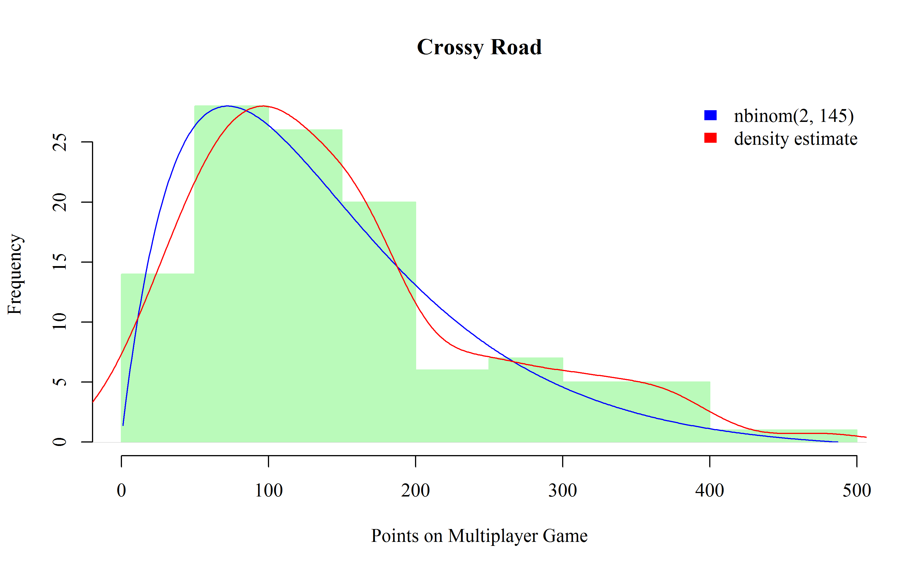

# Crossy Road
Erik-Jan van Kesteren  


###[Back](../index.html)

## Negative Binomial

I played [Crossy Road](http://www.crossyroad.com/) a _lot_ with my girlfriend while on holiday. I wanted to know what kind of distribution our scores follow, so I decided to record our scores for a while. A Negative Binomial distribution fits these scores very well! 
This also agrees with the interpretation of the negative binomial of **the amount of
successful trials before a certain amount of failures**, which is indeed the process governing 
the Crossy Road scores: one jump is a successful trial, and you need 2 failures (both players) to end!
See below how well it fits.


```r
nb <- fitdist(data = cr$Crossy, distr = "nbinom")
summary(nb)
```

```
## Fitting of the distribution ' nbinom ' by maximum likelihood 
## Parameters : 
##        estimate Std. Error
## size   2.000918   0.254252
## mu   145.491423   9.743531
## Loglikelihood:  -663.4684   AIC:  1330.937   BIC:  1336.392 
## Correlation matrix:
##               size            mu
## size  1.0000000000 -0.0002881859
## mu   -0.0002881859  1.0000000000
```

```r
plot(nb)
```


We can make a nice(ish) plot out of it, too:


```r
curve <- dnbinom(1:(max(cr$Crossy+10)),size = coef(nb)[1], mu = coef(nb)[2])

hist(cr$Crossy, breaks = "FD", xlim = c(0,max(cr$Crossy)+10), 
     main = "Crossy Road", xlab = "Points on Multiplayer Game", col = "#BAFABA", 
     border = "#BAFABA")
par(new = T)
plot(curve, xlim = c(0,max(cr$Crossy)+10), type = "l",
      bty = "n", xlab = "", ylab = "", xaxt = "n", yaxt = "n", col = "blue", 
      main = "")
par(new = T)
plot(density(cr$Crossy), xlim = c(0,max(cr$Crossy)+10), main = "",
     bty = "n", xlab = "", ylab = "", xaxt = "n", yaxt = "n", col = "red")
legend("topright", legend = c(paste("nbinom(",round(coef(nb)[1]),", ",
                                    round(coef(nb)[2]),")",sep = ""),
                              "density estimate"), fill = c("blue","red"),
       bty = "n", border = "#FFFFFF")
```



We can see if the time variable has an influence on our scores using a negative binomial
regression. In other words, we can test the hypothesis that we get better at the game over time.


```r
fit <- glm.nb(Crossy~Time, cr)
summary(fit)
```

```
## 
## Call:
## glm.nb(formula = Crossy ~ Time, data = cr, init.theta = 2.005910907, 
##     link = log)
## 
## Deviance Residuals: 
##     Min       1Q   Median       3Q      Max  
## -3.1306  -0.8437  -0.2474   0.2859   2.1569  
## 
## Coefficients:
##             Estimate Std. Error z value Pr(>|z|)    
## (Intercept)  4.91548    0.13468  36.498   <2e-16 ***
## Time         0.00112    0.00205   0.546    0.585    
## ---
## Signif. codes:  0 '***' 0.001 '**' 0.01 '*' 0.05 '.' 0.1 ' ' 1
## 
## (Dispersion parameter for Negative Binomial(2.0059) family taken to be 1)
## 
##     Null deviance: 122.87  on 112  degrees of freedom
## Residual deviance: 122.58  on 111  degrees of freedom
## AIC: 1332.6
## 
## Number of Fisher Scoring iterations: 1
## 
## 
##               Theta:  2.006 
##           Std. Err.:  0.255 
## 
##  2 x log-likelihood:  -1326.642
```

```r
plot(cr$Time, cr$Crossy, col = "dark green", bty = "L", ylab = "Score", xlab= "Time", 
     main = "Change in Scores over Time")
abline(exp(coef(fit)), col = "blue")
```


You can draw your own conclusions from this. Thanks for reading!

Questions that remained:

1. Does the shape parameter change with different amounts of players?

2. How can we incorporate the dependence between consecutive trials? (NB assumes i.i.d. Bernoulli trials)

3. In Crossy Road you both have to die within a short distance. Can this be in the model?
