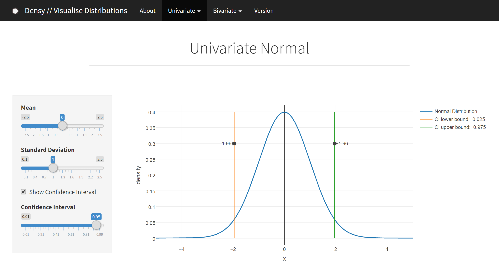

# Densy
Erik-Jan van Kesteren  


###[Back to index](../index.html)

## The problem
Last semester I learnt about probability distributions and density functions. These are the bread and butter of statistics: a concept that comes back over and over again in pretty much all (parametric) statistical procedures. But one thing frustrated me: it is very hard to imagine what a probability distribution is when this is all you see:

$$f(x | \mu,\sigma^2) = \frac{1}{\sqrt{2 \sigma^2 \pi}} \cdot e^{-\frac{(x-\mu)^2}{2\sigma^2}}$$


This is the density function of the normal distribution: the familiar bell curve with on the $x$-axis any real value, and on the $y$-axis the probability density, or likelihood. But this is not all there is to it. The left side of the equation shows that the probability of $x$ depends on two *parameters*: $\mu$ and $\sigma^2$. These are the mean and variance of the distribution. My question was: for all those distribution functions commonly used in the statistical literature, what happens to the shape when we change their parameters?

## The solution
I could already make plots in `R`, but in order to see the changes as they happen, it was obvious to me that I needed some form of application that dynamically updates the graph as parameters are changed. Then I found [shiny](http://shiny.rstudio.com/), a framework by the makers of [RStudio](https://www.rstudio.com/). Shiny makes it ridiculously easy to create interactive dashboards and applications that input variables to `R` and output visually pleasing graphs, tables, and anything else you can squeeze out of it. So I started programming.

## The result

I created a web-app called `Densy`, a fun-sounding combination of "density" and "shiny". `Densy` is not finished, because I went on to do other things, but I still use it every now and then to get a *feeling* with probability distributions. For example, when I stumbled upon the *Cauchy distribution* after a long time, I went back to `Densy` to play with it.

In `Densy`, you can edit parameters of distribution functions and see the changes immediately. This is what it looks like for the normal distribution I outlined above:



In the left-hand panel, you can easily change the parameters $\mu$ and $\sigma$, and you can opt to see a confidence interval as well.

## The result on fire

Around this time, I also found the plotting library [plotly](https://plot.ly/), which can make fantastic interactive 3d graphs like the one below. Go on, mouse over it & drag the image around! (if you're on mobile, I'm terribly sorry but this does not work for you haha).

<iframe width="100%" height="400" frameborder="0" scrolling="no" src="https://plot.ly/~erikjan/3.embed?share_key=HPMG48qGQizPJ0gw0wWxc9"></iframe>

<br/>

So I decided to also implement several bivariate distributions into the application. These are even more fun to play around with, do give it a try!

## OK, OK, you've convinced me, where can I find it!?

Just go to my [shinyapps.io](https://erikjan.shinyapps.io/Densy/) account to see the app in action. If it doesn't work, that's because my free account gets only limited server time. You'll have to wait until next month. However, the best way to run `Densy` is if you have `RStudio` or `R` with the `shiny` package. You can simply run the app by typing in the following commands:
```
install.packages("devtools")
devtools::install_version("plotly", version = "3.6.0", repos = "http://cran.us.r-project.org")
shiny::runGitHub("Densy-Develop", "vankesteren")
```
Click "open in browser" at the top for the best experience. How cool!


###[Back to index](../index.html)
