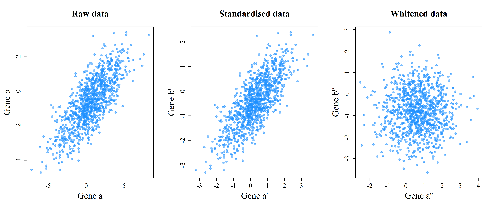

# Whitening
Erik-Jan van Kesteren  


###[Back](../index.html)

## Introduction

The work of Zuber and Strimmer[^1] has inspired me to create this post. The journal articles I linked to in the footnote are absolutely worth reading!

I stumbled upon whitening through my thesis research. In my thesis, I am looking at filter methods for feature selection in high-dimensional data, specifically in microarray (genetic) data. The goal with these data is often classification into two groups, e.g., malignant or benign. Because of the high-dimensional nature of these data (sometimes over 20 000 genes!), we need to select genes which are important for classification^[or use more complex methods with other disadvantages]. 

[^1]: Optimal Whitening: https://arxiv.org/abs/1512.00809

      Correlation-Adjusted t-Scores: http://bioinformatics.oxfordjournals.org/content/25/20/2700.short
      
      Correlation-Adjusted r-Scores: https://arxiv.org/abs/1007.5516 

## Gene selection
Let's take an example of classifying a piece of tissue in two categories using its high-dimensional genomic data: <span style="color:#006400">green</span> and <span style="color:#00008B">blue</span>.
The most simple filter method for feature selection is as follows: Select the genes with the highest *differential expression*, that is $\text{max}\{\text{abs}(\mu_{green}-\mu_{blue})\}$. The intuition behind this is simple: genes that vary a lot across groups are very "predictive" of the class which their objects of study come from. For example, take the two hypothetical genes with expression levels below:


```r
par(family="serif")
# Large DE
polygon(curve(expr = dnorm(x, mean = -2, sd = 1.2), 
              from = -7, to = 7, ylab = "Density", 
              xlab="Expression", bty = "L", ylim = c(0,0.37)),
        border = "#006400", col = "#32CD3288")
abline(v = -2, col= "white")
par(new=TRUE)
polygon(curve(expr = dnorm(x, mean = 2, sd = 1.2), 
              from = -7, to = 10, ylab = "", xlim = c(-7,7),
              xlab="", bty = "n", axes=FALSE, ylim = c(0,0.37)),
        border = "#00008B", col = "#1E90FF88")
abline(v = 2, col= "white")
lines(x=c(-2,2), y = c(0.36, 0.36))
lines(x=c(-2,-2), y = c(0.36, 0.35))
lines(x=c(2,2), y = c(0.36, 0.35))
mtext(text = "Gene A: Large Differential Expression", side = 3)
```


```r
# Small DE
polygon(curve(expr = dnorm(x, mean = -1, sd = 1.2), 
              from = -7, to = 7, ylab = "Density", 
              xlab="Expression", bty = "L", ylim = c(0,0.37)),
        border = "#006400", col = "#32CD3288")
abline(v = -1, col= "white")
par(new=TRUE)
polygon(curve(expr = dnorm(x, mean = 1, sd = 1.2), 
              from = -7, to = 10, ylab = "", xlim = c(-7,7),
              xlab="", bty = "n", axes=FALSE, ylim = c(0,0.37)),
        border = "#00008B", col = "#1E90FF88")
abline(v = 1, col= "white")
lines(x=c(-1,1), y = c(0.36, 0.36))
lines(x=c(-1,-1), y = c(0.36, 0.35))
lines(x=c(1,1), y = c(0.36, 0.35))
mtext(text = "Gene B: Small Differential Expression", side = 3)
```


The gene with the small differential expression has more overlap between classes. Hence, if we would classify based on this gene with a method such as LDA^[[Linear Discriminant Analysis](https://en.wikipedia.org/wiki/Linear_discriminant_analysis)] or logistic regression, our misclassification rate would be higher.


## Correcting for variance
There is a problem with this approach, gene expression variance might differ. Not taking this into account might mean that you consider a gene with high mean difference and even higher variance to be more important than a gene with moderate mean difference but a low variance. Luckily, this problem has been solved ages ago, by using the following quantity instead of the simple mean difference:
$$ \frac{\mu_{green}-\mu_{blue}}{\sigma} \cdot c $$, where
$c = \left( \frac{1}{n_{green}} + \frac{1}{n_{blue}} \right)^{-1/2}$

Yes, this is a *t-score*. As can be seen from the equation, we are correcting for the variance in the original data. We can do this for many genes $(a, b, ...)$ at once, if we collect the variance of each gene expression in a diagonal matrix and the group means in vectors like so:

$$\mathbf{V} = \begin{bmatrix}\sigma_{a} & 0 \\ 0 & \sigma_{b}\end{bmatrix}, \quad \vec{\mu}_{green} = \begin{bmatrix} \mu^{a}_{green} \\ \mu^{b}_{green} \end{bmatrix}, \quad \vec{\mu}_{blue} = \begin{bmatrix} \mu^{a}_{blue} \\ \mu^{b}_{blue} \end{bmatrix}$$

Then we could write the t-score equation as follows^[Isn't linear algebra great?]:

$$t = c \cdot \mathbf{V}^{-1/2}(\vec{\mu}_{green}-\vec{\mu}_{blue})$$

Using this score is the same as performing a differential expression score analysis on *standardised* data. In standardisation, for each gene expression vector you would subtract the mean and divide by the standard deviation. The resulting vector has a standard deviation of 1 and a mean of 0.


## Whitening 
Now, there is one more issue. This is an issue not in univariate space, but in multivariate space. Consider the following figure:


```r
par(family = "serif")
blue <- function(x, y) dmvnorm(cbind(x, y), c(0.6, -0.6), matrix(c(1, 0.7, 0.7, 
    1), ncol = 2))
green <- function(x, y) dmvnorm(cbind(x, y), c(-0.6, 0.6), matrix(c(1, 0.7, 
    0.7, 1), ncol = 2))

precision <- 1000

colblue <- colorRamp(c("#1E90FF88", "#00008BDD"), alpha = T)(seq(0, 1, 0.001))
colgreen <- colorRamp(c("#32CD3288", "#006400DD"), alpha = T)(seq(0, 1, 0.001))

bmat <- outer(seq(-5, 5, length = precision), seq(-5, 5, length = precision), 
    blue)
gmat <- outer(seq(-5, 5, length = precision), seq(-5, 5, length = precision), 
    green)


blueplot <- contourplot(bmat, at = seq(0.005, 0.3, 0.01), row.values = seq(-5, 
    5, length = precision), column.values = seq(-5, 5, length = precision), 
    region = T, labels = F, contour = F, col = "white", colorkey = F, col.regions = rgb(colblue[, 
        1:3], alpha = colblue[, 4], maxColorValue = 255), xlab = "Gene a", ylab = "Gene b", 
    par.settings = list(axis.text = list(fontfamily = "serif"), par.xlab.text = list(fontfamily = "serif"), 
        par.ylab.text = list(fontfamily = "serif"), par.main.text = list(fontfamily = "serif"), 
        par.sub.text = list(fontfamily = "serif")))

greenplot <- contourplot(gmat, at = seq(0.005, 0.3, 0.01), row.values = seq(-5, 
    5, length = precision), column.values = seq(-5, 5, length = precision), 
    region = T, labels = F, contour = F, col = "white", col.regions = rgb(colgreen[, 
        1:3], alpha = colgreen[, 4], maxColorValue = 255))

print(blueplot + as.layer(greenplot))
```

<!-- -->

In this case, Gene a and Gene b individually have a hard time separating the blue and the green category both on their differential expression scores and on their t-scores. You can visualise this by looking at the *marginal distributions*^[by collapsing the densities of the green and the blue classes onto the margin (either the x or y axis) we can construct a figure such as the first two images in this post. See [this image](http://i.stack.imgur.com/sf2zg.jpg) for an example of a bivariate distribution decomposed into two marginals]. 

Multivariately, however, there is little overlap between the green and the blue classes. This happens because Gene a and Gene b are *correlated*. To correct for this correlation, we can perform another step over and above standardisation: *whitening*, or *decorrelation*. 

Below you can find a scatterplot of randomly generated correlating bivariate data, much like one of the ellipses in the graph above. It moves from raw data in the first panel through standardised data (see the axis scale change) to decorrelated data in the third panel. The variance-covariance matrix used for generating the data was as follows:

$$\mathbf{\Sigma} = \begin{bmatrix}5 & 2.4 \\ 2.4 & 2 \end{bmatrix}$$


```r
par(mfrow=c(1,3), family = "serif", mar = c(5,5,5,2))

# Covariance matrix
sigma <- matrix(c(5,2.4,2.4,2),ncol=2)
# Generate raw data
df <- rmvnorm(1000,c(0.6,-0.6),sigma)
plot(data.frame(df), xlab = "Gene a", ylab = "Gene b", main = "Raw data", 
     pch=19, col = "#1E90FF88", cex.lab=2, cex.main=2, cex.axis=1.5)

# Extract variance diagonal matrix and standardise data
V <- diag(diag(sigma))
dfstd <- data.frame(t(solve(sqrt(V))%*%t(df)))
plot(dfstd, xlab = "Gene a", ylab = "Gene b", main = "Standardised data",
     pch=19, col = "#1E90FF88", cex.lab=2, cex.main=2, cex.axis=1.5)

# Perform ZCA-cor whitening (see paper) to decorrelate data
P <- solve(sqrt(V))%*%sigma%*%solve(sqrt(V))
W <- solve(sqrtm(P))%*%solve(sqrtm(V))
dfwhite <- data.frame(t(W%*%t(df)))
plot(dfwhite, xlab = "Gene a", ylab = "Gene b", main = "Whitened data",
     pch=19, col = "#1E90FF88", cex.lab=2, cex.main=2, cex.axis=1.5)
```


